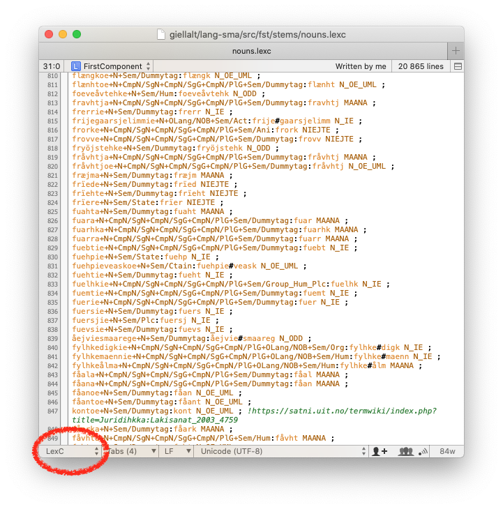
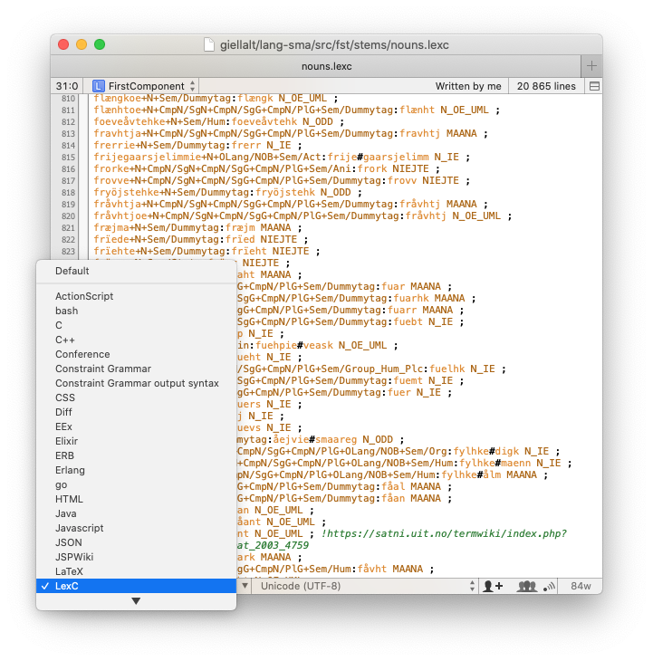
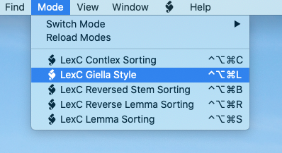
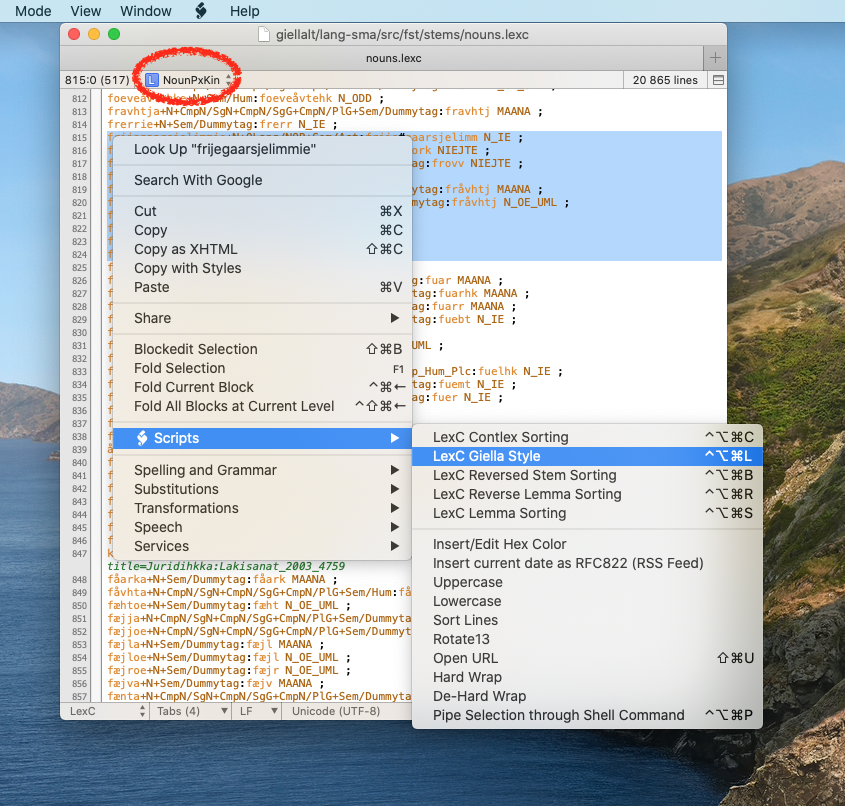

# SEE Modes for GiellaLT

This repo holds syntax modes for [SubEthaEdit](https://subethaedit.net) for the following types of text files:

* [ConstraintGrammar](https://visl.sdu.dk/cg3.html)
* Corpus analysis (Constraint Grammar output)
* [JSPWiki](https://jspwiki-wiki.apache.org/Wiki.jsp?page=TextFormattingRules) - will
  soon be obsolete, most documents are now converted to Markdown
* LexC
* Twolc
* Typos
* Xfst

They are a.o. used in the development of language resources in the [GiellaLT infrastructure](https://github.com/giellalt).

LexC, Twolc and Xfst are tools & formalisms by Xerox, available at <https://web.stanford.edu/~laurik/fsmbook/home.html>, and documented in the book linked to on that site. The same formalisms are supported by the open-source tools [Foma](https://fomafst.github.io) and [Hfst](https://hfst.github.io).

# Install

1. Download the [latest release](releases) - zip file or tarball at your preference
1. Unpack the download if it was not automatically unpacked
1. Double click on each of the SEE modes you want to install
1. Accept to install the modes

# Use

Make sure the wanted mode is displayed in the mode selection area - click and select if not:

With the mode active, you can access mode-specific tools to be used on the whole document or the selection by choosigh from the **Mode** menu or from the context menu:

You can also use the keyboard shortcuts displayed in the menu.

# License

MIT - [LICENSE](LICENSE) or <http://opensource.org/licenses/MIT> (same as SubEthaEdit).

# Contribution

Fork and PR on Github.

Unless you explicitly state otherwise, any contribution intentionally submitted for inclusion in the work by you shall be licensed as above, without any additional terms or conditions.
